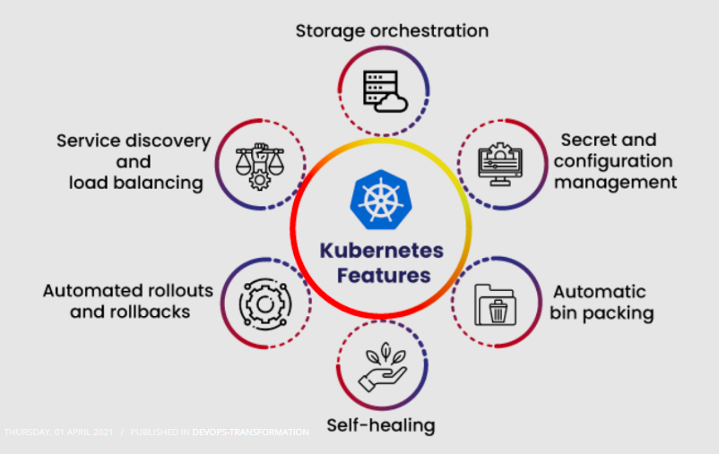
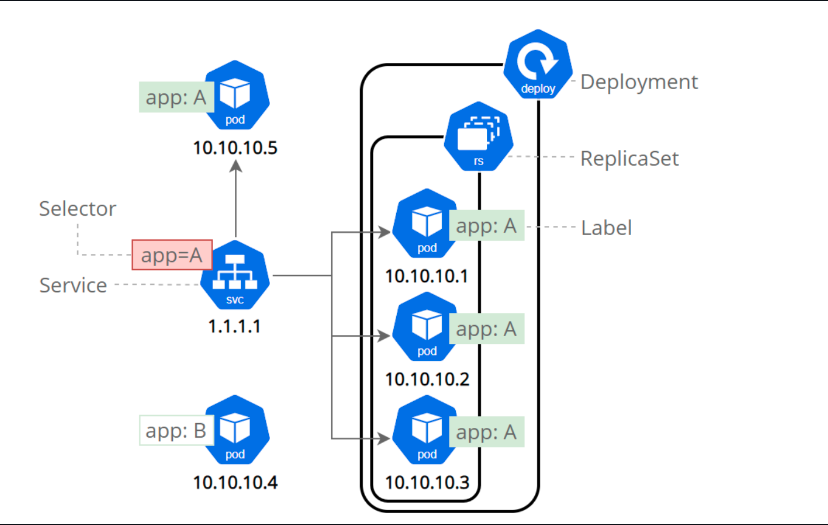
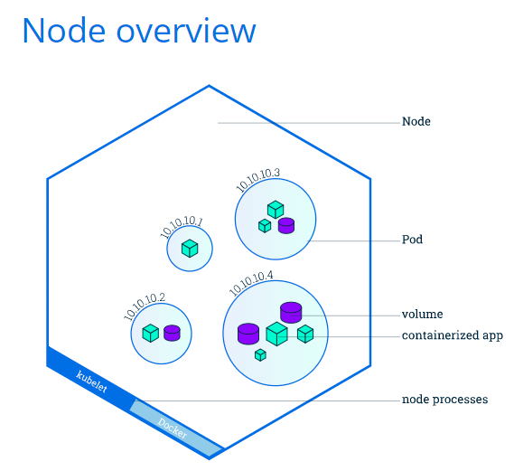

# Kubernetes

## Kubernetes Architecture
- Kubernetes is an open source orchestrator for microservice apps
- Kubernetes clusters together groups of hosts running containers, and helps you easily and efficiently manage those clusters.



- Cluster - made up of one or more masters and a bunch of nodes
  - Nodes (each node is a VM or physical machine) (can have many nodes in a cluster)
    - Pods (can have 1 or more containers in a pod) -- Pods are the smallest deployable units of computing that can be created and managed in Kubernetes.
    - service (stable network endpoint to connect to one or multiple pods)

### Nodes - The Kubernetes Workers
- ``container engine`` - usually docker
- ``kube-proxy`` - handles kubernetes networking
  - pod IP address
    - All containers in a pods share a single IP
  - Load balances across all pods in a service



### Pods
- A pod is a ring-fenced (sandbox) environment to run containers
- containers always run inside of pods in Kubernetes
- All containers in a pod share the pod environment
  - eg share same IP, same volume, share memory

- ``Inter-pod communication:``
  - Every pod gets its own IP an so every pod can talk directly to every other pod
- ``Intra-pod communication``
  - Multiple containers in the same pod communicate over the shared localhost interface
  - To be reached from outside the pod they can be exposed on different ports

#### Pods and Scaling
- To scale, create more pods
  - Do NOT add more containers to a pod

### Service
- A service is a kubernetes object like a pod
  - It's an abstraction which defines a logical set of Pods and a policy by which to access them
  - It's an abstract way to expose an application running on a set of Pods as a network service.
- It sits in front of the backend and provides a dns name for backend pods
- A service is a k8s object and basically a firewall rule. This rule is created basically for two reasons.
  - To exposes pods to the external world.
  - To load balance between a set of pods and get rid of pod ip change if it dies.

### Publishing Services (ServiceTypes)
- ``ClusterIP``: Makes pods available on a stable IP but only from within the cluster
  - This is the default ServiceType
- ``NodePort``: Exposes the app from outside of the cluster
  - A ClusterIP service, to which the NodePort service will route, is automatically created.
- ``LoadBalancer``: Exposes the Service externally using a cloud provider’s load balancer.
  - NodePort and ClusterIP Services, to which the external load balancer routes, are automatically created.


---

apiVersion: apps/v1

kind: Deployment

metadata:
  name: nginx
spec:
  selector:
    matchLabels:
      app: nginx
  replicas: 3
  template:
    metadata:
      labels:
        app: nginx
    spec:
      containers:
        - name: nginx
          image: smhzaihr/eng114_syed_docker
          ports:
            - containerPort: 80
          imagePullPolicy: Always 
 ````
- ``labels``: Labels are key/value pairs that are attached to objects (in this case the service). Labels are intended to be used to specify identifying attributes of objects that are meaningful and relevant to users
- ``selector``: Allows users to filter a list of resources based on labels. The set of Pods targeted by a Service is usually determined by a selector.
- ``port: 80``: used to define the port on which the service listens on
- ``targetPort: 80``: the actual port on which your application is running inside the container
- Once the service receives traffic from an external source:
  - it sends the traffic received on ``nodePort`` and forwards that to the ``port`` the service is listening on
  - it redirects the traffic received on ``port`` to ``targetPort`` which is the directive used to define port on which container has exposed the application.


- ``kubectl expose deployment <deployment_name> --port 80 --type LoadBalancer``


### Deployments
- A Deployment provides declarative updates for Pods and ReplicaSets.
- Deployed via YAML (or JSON) manifests
- Deployed via the apiserver
- Deployments are used for:
  - Rolling updates and rollbacks
  - also deploying pods (replica sets - scalability and reliability)
- ``kubectl apply -f deploy.yml --record``

````
apiVersion: v1
kind: Service
metadata:
  name: nginx
  namespace: default
spec:
  ports:
   - nodePort: 30442 
     protocol: TCP
     port: 80
     targetPort: 80
     
  selector:
    app: nginx
  type: NodePort
````
- ``labels``: Assigns this label when creating the Deployment
- ``spec.selector.matchLabels``: means control the ReplicaSet/Pods which have this label
- ``template``: is a a podTemplate. It describes the pods that are launched.
- ``template.metadata.labels``: Assigns this label when creating the ReplicaSet/Pod


### Commands

- ``kubectl get nodes``
  - This command shows all nodes that can be used to host our applications.
- ``kubectl describe deploy <deployment_name>``
- ``kubectl apply -f ./pod.yml``
  - creates or applies a config to a resource
- ``kubectl apply -f deploy.yml --record``
  - use the ``--record`` flag for deployments for the deployment history
- ``kubectl expose deployment <deployment_name> --port 80 --type LoadBalancer``
   - Expose containers to the internet
   - Kubernetes created a service and an external load balancer with a public IP address attached to it. The IP address remains the same for the life of the service. Any network traffic to that public IP address is routed to pods behind the service
- ``kubectl logs <name_of_pod>``
  - get the logs of a pod

# Deploying Nodejs Sample App and MongoDB using Kubernetes


## MongoDB deployments and Internal LoadBalancer
- create the mongodb_deploy.yml and mongodb_service.yml files

- ``kubectl apply -f db_deploy.yml``
- ``kubectl apply -f svc_db.yml``

- Find the external IP of the mongodb service ``mongodb-svc``
  - run ``kubectl get svc``


## App Deployment and LoadBalancer
- create the app_deploy.yml and app_service.yml file

- replace ``mongodb-svc`` in ``value: "mongodb://mongodb-svc:27017/posts"`` with the external IP of the mongodb service ``mongodb-svc`` then
- ``kubectl apply -f app_deploy.yml``

- ``kubectl apply -f svc-app.yml``

# Some components of K8

## The Control plane (master)
The Control plane is made up of the kube-api server, kube scheduler, cloud-controller-manager and kube-controller-manager. Kube proxies and kubelets live on each node, talking to the API and managing the workload of each node.

As the control plane handles most of Kubernetes’ ‘decision making’, nodes which have these components running generally don’t have any user containers running - these are normally named as master nodes.

## Cloud-controller-manager
The cloud-controller-manager runs in the control plane as a replicated set of processes (typically, these would be containers in Pods). The cloud-controller-manager is what allows you to connect your clusters with the cloud provider’s API and only runs controllers specific to the cloud provider you’re using.

## Etcd
etcd is a distributed key-value store and the primary datastore of Kubernetes. It stores and replicates the Kubernetes cluster state.
To run etcd, you first need to have a Kubernetes cluster and the command-line tool configured to communicate with said cluster.

## Kubelet
The kubelet functions as an agent within nodes and is responsible for the runnings of pod cycles within each node. Its functionality is watching for new or changed pod specifications from master nodes and ensuring that pods within the node that it resides in are healthy, and the state of pods matches the pod specification.

## Kube-proxy
Kube-proxy is a network proxy that runs on each node. It maintains network rules, which allow for network communication to Pods from network sessions inside or outside of a cluster. Kube-proxy is used to reach kubernetes services in addition to load balancing of services.

## Kube-controller-manager
The Kubernetes controller manager is a collection of controllers bundled within a single binary and run in a single process. The following controllers are present within this manager:

 - Node controller: Responsible for identifying changes in nodes within the cluster

 - Replication controller: Responsible for maintaining replications of objects in the cluster (such as replicasets)

 - Endpoint controller: Responsible for provisioning of endpoints (such as service endpoints)

 - Service account and token controllers: Responsible the management of service accounts within each namespace, as well as API access tokens

## Kube-API Server
The Kube-API server, a component within the control plane, validates and configures data for API objects, including pods and services. The API Server provides the frontend to the cluster's shared state, which is where all of the other components interact. This means that any access and authentication such as deployments of pods and other Kubernetes API objects via kubectl are handled by this API server.

## Kube-scheduler
Running as part of the control plane, the kube-scheduler’s responsibility is to assign pods to nodes within your cluster. The scheduler will use information such as compute requests and limits defined within your workload (if any), as well as finding the right node candidate based on its available resources to appropriately assign your workload to a particular node.

## Node
Kubernetes runs workloads by placing your pods into nodes. Depending on your environment, a node can represent a virtual or physical machine. Each node will contain the components necessary to run pods. There are two distinct classifications of a node within Kubernetes: Master and Worker nodes.

### Worker nodes: Worker nodes will have an instance of kubelet, kube-proxy and a certain container runtime (such as Docker, containerd) running on each node, and are used to run user defined containers. These nodes are managed by the control plane.

### Master nodes: A master node, or sometimes called control-plane nodes will have the control plane binaries bootstrapped, and will only be responsible for all components within the control plane, such as runnings of etcd and the kube-api-server. In order to achieve high availability with etcd to establish a quorum, there are normally more than 3 master nodes within a cluster.
